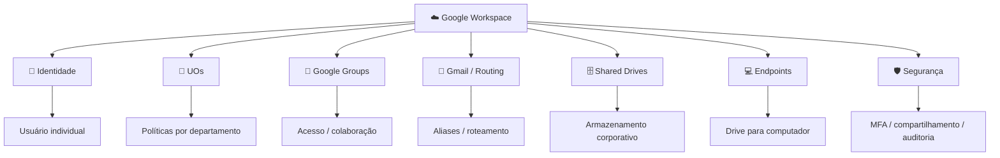
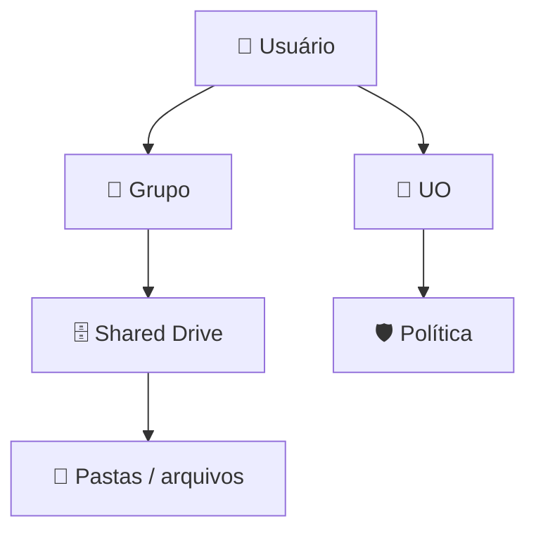

# ☁️ Google Workspace IT Modernization

> **Case Study de Infraestrutura, Governança e Migração Corporativa**

[](#-status-do-projeto)
[](#-escopo)
[](#-arquitetura-alvo)

## 🎯 Sobre o projeto

Este repositório documenta um projeto de modernização de ambiente corporativo baseado em **Google Workspace**, concebido para substituir gradualmente uma arquitetura tradicional apoiada em **Active Directory, servidor de arquivos, compartilhamentos SMB, contas genéricas e regras de e-mail pouco centralizadas**.

O projeto foi estruturado como um **case técnico de portfólio**, com dados, nomes, domínios, endereços e identificadores reais sanitizados.

A proposta não é tratar o Google Workspace como uma simples substituição de tecnologia, mas como uma mudança de **arquitetura e governança**:

```text
┌──────────────────────────────────────────────────────────┐
│                AMBIENTE CORPORATIVO LEGADO               │
├──────────────────────────────────────────────────────────┤
│ Active Directory │ File Server │ SMB │ Contas genéricas │
│ GPOs             │ NTFS        │ VPN │ E-mail legado   │
└─────────────────────────────┬────────────────────────────┘
                              │
                         Modernização
                              │
                              ▼
┌──────────────────────────────────────────────────────────┐
│                  GOOGLE WORKSPACE                         │
├──────────────────────────────────────────────────────────┤
│ Identidade │ UOs │ Groups │ Políticas │ Gmail Routing   │
│ Drive      │ Shared Drives │ Endpoints │ Governança     │
└──────────────────────────────────────────────────────────┘
```

---

## 🚀 Objetivos

- 👤 Padronizar a identidade dos usuários.
- 🧹 Reduzir e reorganizar contas genéricas.
- 🏢 Estruturar **Organizational Units (UOs)**.
- 👥 Estruturar **Google Groups** para acesso e colaboração.
- 🔐 Reorganizar políticas e controles de segurança.
- 📧 Criar uma estratégia de governança de e-mail.
- 📨 Estruturar aliases, roteamento e endereços departamentais.
- 🗄️ Criar uma arquitetura de **Shared Drives**.
- 📁 Planejar a migração do servidor de arquivos.
- 🧪 Implementar piloto antes da migração em escala.
- 🔄 Garantir continuidade operacional e rollback.
- 📚 Criar documentação sustentável para operação futura.

---

## 🧭 Escopo

| Domínio | Escopo |
|---|---|
| 👤 Identidade | Usuários, contas genéricas, aliases, desligamentos |
| 🏢 Estrutura | UOs e grupos de configuração |
| 👥 Acesso | Google Groups e matriz de permissões |
| 🛡️ Políticas | Mapeamento de GPOs e políticas do Workspace |
| 📧 E-mail | Aliases, grupos, roteamento e catch-all |
| 🗄️ Armazenamento | Shared Drives e estrutura de pastas |
| 📁 Migração | Inventário, classificação, piloto e migração |
| 💻 Endpoints | Drive para computador, dispositivos e políticas |
| 🔒 Segurança | MFA, compartilhamento, privilégios e auditoria |
| 🧪 Validação | Piloto, homologação e critérios de aceite |
| 📚 Governança | Padrões, documentação e operação |

---

## 🏗️ Arquitetura alvo



---

## 🧩 Modelo conceitual

> **UO define principalmente o escopo de políticas.**  
> **Grupo define principalmente associação, colaboração e acesso.**  
> **Shared Drive define o espaço corporativo de armazenamento.**

| Conceito legado | Conceito alvo | Observação |
|---|---|---|
| 👤 Usuário AD | 👤 Usuário Workspace | Identidade individual |
| 🏢 OU | 🏢 UO Workspace | Escopo de políticas |
| 👥 Security Group | 👥 Google Group | Associação e acesso |
| 📁 File Share | 🗄️ Shared Drive | Armazenamento de equipe |
| 🔐 NTFS / Share Permission | 🔐 Permissões do Drive | Modelo diferente; não é cópia 1:1 |
| ⚙️ GPO | 🛡️ Políticas Workspace / Endpoint / Chrome | Mapear finalidade, não apenas configuração |
| 🖥️ SMB | ☁️ Drive / Drive para computador | Mudança de modelo de acesso |

---

# 🗺️ Roadmap do projeto

| # | Etapa | Codinome | Status |
|---:|---|---|---|
| 01 | Identidade e saneamento | 🐂 **DAR NOME AOS BOIS** | 🟡 Planejado |
| 02 | UOs e grupos | 🏠 **ARRUMANDO A CASA** | 🟡 Planejado |
| 03 | Políticas | 🛡️ **CADA MACACO NO SEU GALHO** | 🟡 Planejado |
| 04 | Governança de e-mail | 📧 **CADA E-MAIL NO SEU LUGAR** | 🟡 Planejado |
| 05 | Catch-all e endereços históricos | 🕳️ **CAIXA PRETA** | 🟡 Planejado |
| 06 | Permissões | 🔐 **CADA UM NO SEU QUADRADO** | 🟡 Planejado |
| 07 | Shared Drives | 🗄️ **CADA COISA NO SEU ARMÁRIO** | 🟡 Planejado |
| 08 | Inventário do servidor de arquivos | 🌊 **PRÉ DILUVIO** | 🟡 Planejado |
| 09 | Classificação dos arquivos | 🧹 **LIXO QUE NÃO SE JOGA FORA** | 🟡 Planejado |
| 10 | Piloto | 🧪 **PRIMEIRO A GENTE TESTA** | 🟡 Planejado |
| 11 | Migração | ⛵ **ARCA DE NOÉ** | 🟡 Planejado |
| 12 | Validação | 🔎 **E AGORA, DEU CERTO?** | 🟡 Planejado |
| 13 | Transição | 🔄 **UM PÉ NO NOVO, OUTRO NO ANTIGO** | 🟡 Planejado |
| 14 | Desativação do legado | 🧓 **APOSENTANDO O VELHO GUERREIRO** | 🟡 Planejado |
| 15 | Documentação | 📚 **SE NÃO ESTÁ ESCRITO, NUNCA EXISTIU** | 🟡 Planejado |

---

# 📚 Documentação

- [🎯 Contexto e objetivos](docs/01-contexto-e-objetivos.md)
- [🔎 Levantamento do ambiente](docs/02-levantamento-do-ambiente.md)
- [🏗️ Arquitetura alvo](docs/03-arquitetura-alvo.md)
- [👤 Identidade e usuários](docs/04-identidade-e-usuarios.md)
- [🏢 Organizational Units](docs/05-organizational-units.md)
- [👥 Grupos e permissões](docs/06-grupos-e-permissoes.md)
- [🛡️ Políticas e segurança](docs/07-politicas-e-seguranca.md)
- [📧 E-mail e roteamento](docs/08-email-e-roteamento.md)
- [🗄️ Shared Drives](docs/09-shared-drives.md)
- [🚚 Migração de arquivos](docs/10-migracao-de-arquivos.md)
- [🧪 Piloto e validação](docs/11-piloto-e-validacao.md)
- [⚠️ Riscos e rollback](docs/12-riscos-e-rollback.md)
- [📚 Lições aprendidas](docs/13-licoes-aprendidas.md)

### Matrizes

- [👥 Matriz de grupos](governance/groups-matrix.md)
- [🔐 Matriz de permissões](governance/permissions-matrix.md)
- [📧 Matriz de roteamento](governance/email-routing-matrix.md)
- [🛡️ Mapeamento de políticas](security/policy-mapping.md)

---

# 🔄 Estratégia de migração

```mermaid
flowchart LR
    A["🔎 Inventário"] --> B["🧹 Classificação"]
    B --> C["👤 Responsável"]
    C --> D["🔐 Permissões"]
    D --> E["🗂️ Estrutura de destino"]
    E --> F["🧪 Piloto"]
    F --> G["✅ Validação"]
    G --> H["🚚 Migração por lotes"]
    H --> I["🔎 Homologação"]
    I --> J["🔄 Transição"]
    J --> K["🧓 Desativação do legado"]
```



> **Princípio:** nenhum arquivo deve ser migrado simplesmente porque existe. Antes da transferência, deve ser identificado seu propósito, responsável, necessidade de manutenção e nível de acesso.

> **Princípio de segurança:** nenhum dado deve ser excluído do servidor exclusivamente porque foi migrado para o Google Workspace.

---

# 🔐 Governança de acesso



A arquitetura procura evitar que permissões sejam administradas usuário a usuário sempre que um grupo puder representar corretamente a necessidade de acesso.

---

# 📧 Governança de e-mail

Exemplo conceitual:

```text
                    📧 Mensagem
                         │
                         ▼
               ┌───────────────────┐
               │ Destinatário      │
               │ pertence ao grupo?│
               └─────────┬─────────┘
                         │
                    ┌────┴────┐
                   SIM       NÃO
                    │          │
                    ▼          ▼
             📬 Entrega    📬 Entrega
                 +             normal
             👔 cópia
             gerente
```

> As regras reais devem ser testadas em ambiente controlado antes da aplicação ampla, principalmente quando houver cópias adicionais, exceções e mensagens enviadas.

---

# ⚠️ Segurança e privacidade

Este repositório é uma **versão sanitizada** de um projeto corporativo.

Não devem ser publicados:

- ❌ credenciais;
- ❌ tokens;
- ❌ IPs internos;
- ❌ nomes reais de servidores;
- ❌ endereços reais de usuários;
- ❌ dados de clientes;
- ❌ configurações sensíveis;
- ❌ prints com informações internas;
- ❌ identificadores administrativos;
- ❌ regras de segurança que exponham o ambiente real.

---

# 📈 Critérios de sucesso

| Área | Critério |
|---|---|
| 👤 Identidade | Usuários possuem identidade individual |
| 👥 Grupos | Acesso departamental é administrável por grupos |
| 🏢 UOs | Políticas aplicadas ao escopo correto |
| 📧 E-mail | Endereços departamentais possuem governança |
| 🗄️ Arquivos | Dados possuem destino e responsável definidos |
| 🔐 Segurança | Privilégios e compartilhamentos revisados |
| 🧪 Piloto | Cenários críticos validados |
| 🚚 Migração | Integridade e acesso confirmados |
| 🔄 Continuidade | Rollback definido durante transição |
| 📚 Operação | Documentação disponível |

---

# 🧠 O que este projeto demonstra

### Infraestrutura
- Arquitetura de identidade
- Active Directory
- Google Workspace
- File Server
- Migração

### Cloud / SaaS
- Google Workspace
- Groups
- Shared Drives
- Gmail Routing
- Endpoint Management

### Governança
- Gestão de acessos
- Políticas
- Padronização
- Lifecycle de usuários
- Governança de dados

### Gestão de projeto
- Levantamento
- Análise
- Piloto
- Migração por etapas
- Validação
- Rollback
- Documentação

---

# 📖 Referências oficiais

- [Google Workspace — Drives compartilhados](https://support.google.com/a/users/answer/7212025?hl=pt-BR)
- [Google Workspace — Práticas recomendadas para drives compartilhados](https://support.google.com/a/users/answer/13015138?hl=pt-BR)
- [Google Workspace — Criar um drive compartilhado](https://support.google.com/a/users/answer/9310249?hl=pt-BR)
- [Google Workspace — Acesso em drives compartilhados](https://support.google.com/a/users/answer/12380484?hl=pt-BR)

---

## 📌 Status do projeto

**Status:** 🟡 Em desenvolvimento / documentação

**Tipo:** Case Study de Infraestrutura

**Foco:** Google Workspace + Governança + Migração

**Observação:** esta versão é destinada a portfólio profissional e utiliza informações fictícias ou sanitizadas.
