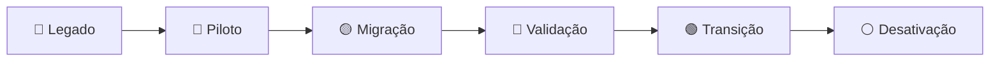

# 🏗️ Ambiente atual × arquitetura alvo

## 🔴 Atual

```text
👤 Usuários
    │
    ▼
🏢 Active Directory
    │
    ├── ⚙️ GPO
    ├── 👥 Security Groups
    │
    ▼
🖥️ File Server
    │
    ├── SMB
    ├── NTFS
    └── Compartilhamentos
```

## 🟢 Alvo

```text
☁️ Google Workspace
    │
    ├── 👤 Usuários
    ├── 🏢 UOs
    ├── 👥 Groups
    ├── 🛡️ Políticas
    ├── 📧 Gmail / Routing
    ├── 💻 Endpoints
    │
    ▼
🗄️ Shared Drives
```

## 🔄 Transição


