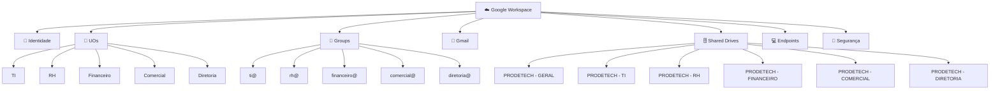

# 🏗️ 03 — Arquitetura alvo

## Visão



## 🧩 Princípios

### 1. Identidade individual

Cada colaborador possui uma identidade própria.

### 2. Políticas por escopo

UOs representam principalmente o escopo de políticas e configurações.

### 3. Acesso por grupo

Grupos representam necessidades de acesso e colaboração.

### 4. Armazenamento por equipe

Shared Drives representam espaços corporativos persistentes.

### 5. Migração gradual

O legado permanece disponível durante as fases de validação e transição.

---

## 🔄 Modelo de decisão

```text
Necessidade
   │
   ├── É identidade? ───────► 👤 Usuário
   │
   ├── É política? ─────────► 🏢 UO
   │
   ├── É acesso? ───────────► 👥 Grupo
   │
   ├── É armazenamento? ────► 🗄️ Shared Drive
   │
   └── É comunicação? ──────► 📧 Gmail / Group / Routing
```
