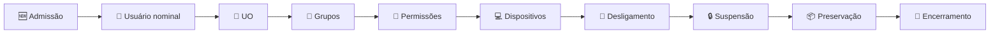

# 👤 04 — Identidade e usuários

## 🐂 DAR NOME AOS BOIS

### Problema

```text
ANTES

financeiro@ ──► utilizado por João
comercial@  ──► utilizado por Maria
rh@         ──► utilizado por Ana
```

### Proposta

```text
DEPOIS

joao.silva@ ──► João
maria.souza@ ─► Maria
ana.costa@  ─► Ana

financeiro@ ──► Grupo Financeiro
comercial@  ──► Grupo Comercial
rh@         ──► Grupo RH
```

## 🔄 Lifecycle



## 🔍 Auditoria prévia

Para cada conta:

- [ ] Uso atual
- [ ] Responsável
- [ ] Aliases
- [ ] Encaminhamentos
- [ ] Delegações
- [ ] Recuperação
- [ ] Integrações
- [ ] Dados
- [ ] Necessidade de retenção
