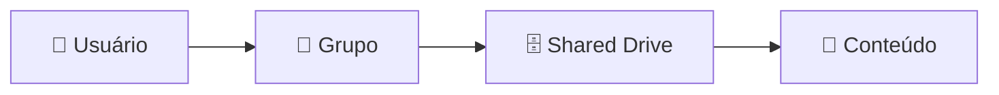

# 👥 06 — Grupos e permissões

## 👥 CADA UM NO SEU QUADRADO

### Modelo



### Grupos departamentais

```text
ti@
rh@
financeiro@
comercial@
diretoria@
funcionarios@
```

### Grupos de exceção

Quando um usuário precisa de acesso adicional, preferir um grupo de exceção:

```text
👤 Pedro
   │
   ├── 👥 comercial@
   │
   └── 👥 acesso-financeiro-ti@
```

em vez de transformar o usuário em membro permanente do grupo departamental Financeiro apenas para obter acesso pontual.

## 🔐 Princípios

- Menor privilégio.
- Acesso por função.
- Exceções documentadas.
- Evitar permissões individuais quando grupo resolver.
- Revisar grupos periodicamente.

## 📊 Matriz

| Grupo | Finalidade | Tipo |
|---|---|---|
| `funcionarios@` | Comunicação geral | Distribuição |
| `ti@` | Equipe de TI | Departamento |
| `financeiro@` | Equipe Financeira | Departamento |
| `comercial@` | Equipe Comercial | Departamento |
| `acesso-projeto-x@` | Exceção controlada | Acesso |
