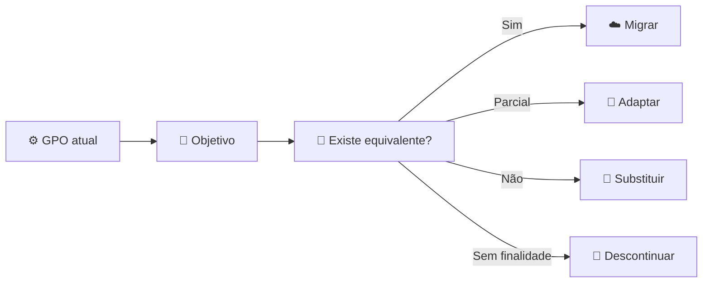

# 🛡️ 07 — Políticas e segurança

## 🐒 CADA MACACO COM SUA REGRA

O objetivo não é copiar GPOs literalmente. O objetivo é preservar a **finalidade de segurança e operação** utilizando os mecanismos disponíveis no novo ambiente.

## 🔄 Método

## 📋 Matriz de análise

| Política legada | Objetivo | Destino | Decisão |
|---|---|---|---|
| Política de navegador | Padronização | Chrome Management | Adaptar |
| Senhas | Autenticação | Workspace | Substituir |
| Mapeamento SMB | Acesso a arquivos | Shared Drives | Substituir |
| Restrições de dispositivo | Segurança | Endpoint Management | Adaptar |
| Configuração de navegador | Controle | Chrome Management | Migrar |
| Permissões NTFS | Acesso | Groups + Shared Drives | Substituir |

## 🔐 Baseline

- MFA
- Contas administrativas separadas
- Menor privilégio
- Compartilhamento externo controlado
- Revisão de grupos
- Auditoria
- Gestão de dispositivos
- Políticas de navegador
- Processo de desligamento
- Recuperação de contas
