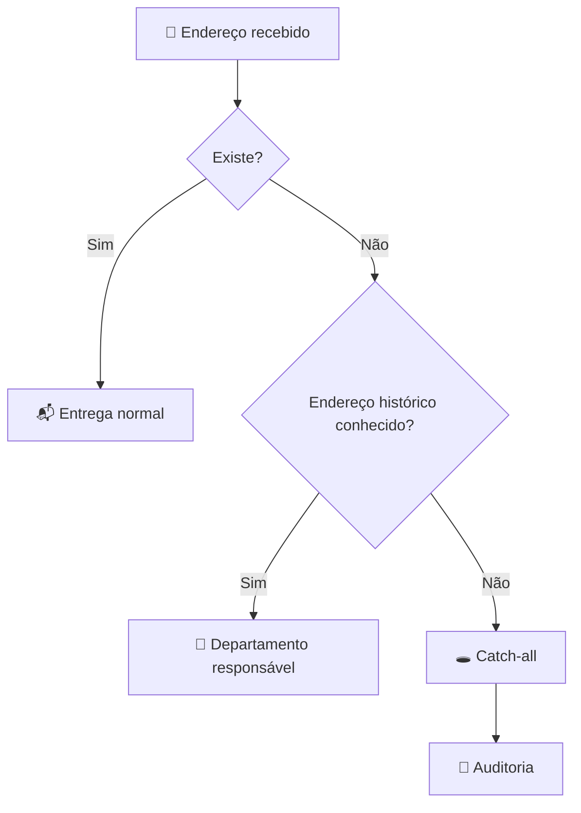

# 📧 08 — E-mail e roteamento

## 📬 CADA E-MAIL NO SEU LUGAR

A governança de e-mail deve separar:

1. 👤 identidade individual;
2. 🏢 endereço departamental;
3. 🏷️ alias;
4. 🔀 roteamento;
5. 🕳️ catch-all;
6. ⚙️ integrações.

## 🏢 Endereço departamental

```text
ANTES

financeiro@
      ↓
conta de usuário
      ↓
João
```

```text
DEPOIS

financeiro@
      ↓
👥 Grupo Financeiro
      ↓
┌─────────┬─────────┐
João      Maria     Ana
```

## 🏷️ Alias de grupo

Exemplo:

```text
comercial@
    ▲
    │
vendas@
orcamentos@
propostas@
```

A avaliação deve considerar se cada endereço é realmente necessário e se há integrações dependentes dele.

---

## 🔀 Roteamento por departamento

Objetivo conceitual:

```text
Cliente
   │
   ▼
📧 Pedro
   │
   ├────────► 📬 Pedro
   │
   └────────► 👔 Gerente Comercial
```

### Modelo de governança

| Campo | Exemplo |
|---|---|
| Departamento | Comercial |
| Grupo | `comercial@` |
| Responsável | Gerente Comercial |
| Escopo | Recebidos |
| Ação | Entrega adicional |
| Exceção | Próprio gerente |
| Finalidade | Supervisão operacional |
| Revisão | Periódica |

> ⚠️ Regras de roteamento devem ser testadas antes de aplicação ampla. O comportamento de mensagens recebidas, internas e enviadas pode exigir regras distintas.

---

## 🕳️ Catch-all

### Problema

```text
usuario-inexistente@
endereco-antigo@
erro-de-digitacao@
       │
       ▼
   catch-all
       │
       ▼
     contato@
```

### Estratégia



O catch-all deve ser tratado como **última camada**, não como solução para desorganização de endereços.

---

## 🔍 Auditoria

Para cada endereço capturado:

- Remetente
- Destinatário
- Frequência
- Assunto
- Departamento provável
- Endereço legítimo
- Ação recomendada
