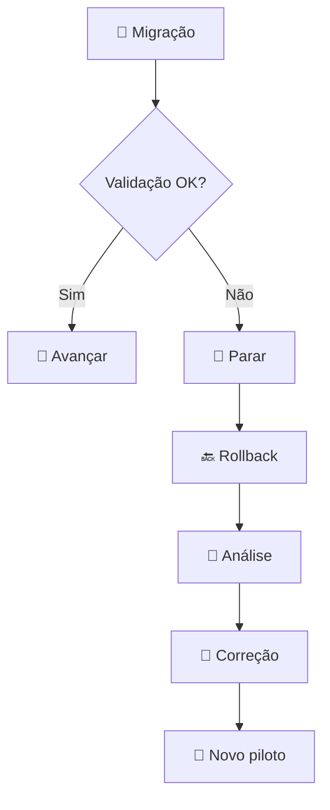

# ⚠️ 12 — Riscos e rollback

## ⚠️ Matriz

| Risco | Impacto | Mitigação |
|---|---|---|
| Perda de arquivos | 🔴 Alto | Backup + rollback |
| Permissões erradas | 🔴 Alto | Matriz + homologação |
| E-mail não entregue | 🔴 Alto | Teste de roteamento |
| Duplicidade de e-mails | 🟠 Médio | Regras + exceções |
| Arquivos incompatíveis | 🟠 Médio | Piloto |
| Usuário sem acesso | 🔴 Alto | Validação |
| Dependência externa | 🟠 Médio | Inventário |
| Migração incompleta | 🔴 Alto | Relatório de validação |

## 🔄 Estratégia de rollback

### Regra

O ambiente legado não deve ser desativado antes de:

- homologação;
- aceite do departamento;
- confirmação de acesso;
- confirmação de integridade;
- período de segurança;
- definição de rollback.
